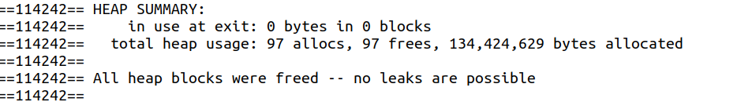
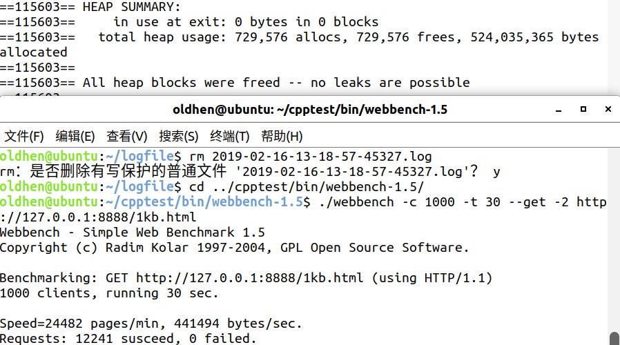

# 对象生命周期的管理  
# 用到RAII模式的地方  
1)、Mutex、MutexGuard;  
2)、Logger;  
3)、Connection是以std::shared_ptr包裹的；  
# 交换指针以减小临界区
1)、AsyncLog::writeToFile;  
2)、EventLoop::executeCallbacks;  
# 关于内存泄漏的检测 
由于正常情况下服务端一直在一个循环中等待事件驱动，故用valgrind直接进行检测的话肯定不行，这里通过在main reactor中注册一个定时器事件(5s)，超时关闭服务端，然后再查看服务端完全结束后的内存泄漏情况，结果是没有内存泄漏的:  
  
然后测试下有并发连接情况下的内存泄漏，测试如下:通过webbench压测30s(短连接),而定时器事件35s后关闭服务端,结果如下:  
  